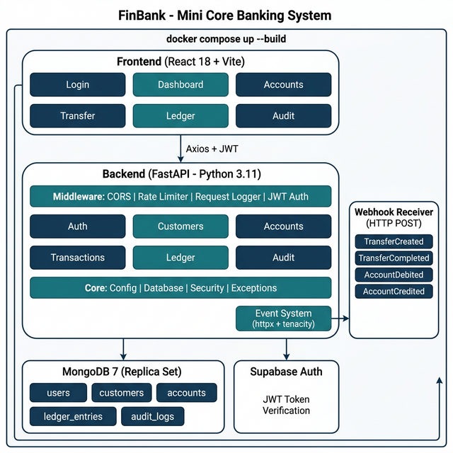

# FinBank — Mini Core Banking System

> **Team 2**: Python + MongoDB + Webhooks  
> **Architecture**: Modular Monolith + Microservices (Bonus)  
> **Course**: 2025-2026 FinTech — Department of International Trade and Business

| 🔗 Link | URL |
|---------|-----|
| **GitHub** | https://github.com/abdullahyldxz-netizen/finbank-core-banking |
| **Live Frontend** | https://finbank-core-banking.pages.dev |
| **API Docs (Swagger)** | https://finbank-api.onrender.com/docs |

---

## 🏗️ Architecture

This project supports **two deployment modes**:

### Option A — Modular Monolith (Primary)
Single backend application with internally separated modules. Start with:
```bash
docker compose up --build
```

### Option B — Microservices (Bonus)
8 separate services with API Gateway, each running on its own port. Start with:
```bash
cd infra && docker compose up --build
```

**Microservices:**
| Service | Port | Responsibility |
|---------|------|----------------|
| API Gateway (Nginx) | 8000 | Request routing |
| Auth Service | 8001 | JWT + RBAC |
| Banking Service | 8002 | Accounts, Transfers, Ledger |
| Notification Service | 8003 | Email, Webhook events |
| Analytics Service | 8004 | Reports, Statistics |
| Admin Service | 8005 | Admin operations |
| Employee Service | 8006 | Employee operations |
| Chatbot Service | 8007 | Gemini AI chatbot |

**Modular Monolith Modules:**
- `auth` — JWT-based authentication + RBAC (Admin/Customer/Employee/CEO)
- `customers` — Customer creation + mock KYC verification
- `accounts` — Account opening + balance inquiry (computed from ledger)
- `ledger` — Append-only ledger (single source of truth)
- `transactions` — Deposit, withdrawal, internal transfer, FAST (alias resolution)
- `audit` — Admin-level audit trail
- `cards` — Virtual card management, limits, freezing
- `easy_addresses` — Kolay Adres management (Email, Phone, TC Kimlik)
- `payment_requests` — "Ödeme İste" and split bill functionality
- `auto_bills` — Recurring automatic bill payments
- `approvals` — Multi-layer approval processing for high-risk operations
- `exchange` — Foreign exchange rates and conversions
- `employee` & `admin` — Privilege-separated operational dashboards

### Architecture Diagram



### How It Maps to Real Financial Standards

| Our System | Real-World Standard | Mapping |
|---|---|---|
| REST/JSON APIs | **ISO 20022** XML messages | Each endpoint (transfer, deposit) parallels an ISO 20022 message type (pacs.008, camt.053). Our JSON payloads follow similar data structures (debtor, creditor, amount, currency). |
| JWT Bearer Auth | **Open Banking (PSD2)** mTLS + API keys | JWT simulates the OAuth2 token exchange used in PSD2. Our RBAC maps to PSD2's TPP consent model where access is scoped by role. |
| Webhooks | **SWIFT gpi** push notifications | Our webhook events (TransferCreated → TransferCompleted) mirror SWIFT gpi's tracker updates. Real banks push status via gpi Tracker API. |
| Ledger entries | **Double-entry bookkeeping** | Every transfer creates paired DEBIT + CREDIT entries, matching how real banks use T-accounts. Debit always equals credit (accounting equation). |
| Account IBAN | **Turkish IBAN format** | Generated IBANs follow TR + 2 check digits + 5 bank digits + account number format. |
| Audit logs | **PCI DSS** compliance logging | Our audit captures who/what/when/outcome, similar to PCI DSS Requirement 10 (track all access). |
| Transfer validation | **EMV** transaction authorization | Amount limits, account ownership checks, and balance verification mirror EMV's card authorization flow. |

### Phase 2 Features (Advanced Banking)
- **Virtual & Physical Cards**: Card generation, cvv/expiry masking, online/contactless limits, debt payment, freezing.
- **Credit Card Cash Advance (Nakit Avans)**: Transferring funds directly from a credit card account to any IBAN or Kolay Adres.
- **Interactive 3D UI**: Fully animated 3D flip card designs for credit/debit cards on the frontend.
- **Easy Address (FAST)**: Sending money via Phone, Email, or National ID instead of IBAN.
- **Payment Requests & Split Bill (Alman Usulü)**: Requesting money from others and splitting expenses equally.
- **Auto Bill Payments**: Setting up recurring, limit-based automated utility bill payments.
- **QR Operations**: Generating and scanning QR codes for fast transfers.
- **Premium UI/UX**: Admin and Employee panels with real-time search, animated transitions, and mock system actions.

### Technology Trade-Off Decisions

| Decision | Chosen | Alternative | Rationale |
|---|---|---|---|
| Architecture | **Modular Monolith** | Microservices | Financial consistency crucial; shared DB avoids saga pattern complexity. 3-person team favors simpler deployment. |
| Backend | **Python + FastAPI** | Node.js, Java Spring | Fastest development; async support for concurrent users; built-in Swagger; Pydantic validation. |
| Database | **MongoDB** (NoSQL) | PostgreSQL (SQL) | Flexible schema for rapid iteration; replica set provides ACID transactions; JSON-native for REST API. |
| Auth Provider | **Supabase Auth** | Custom JWT | Production-grade auth without building from scratch; email verification; session management; easy RBAC integration. |
| Events | **Webhooks** (HTTP POST) | Kafka, RabbitMQ | Simplest to implement and debug; assignment requires at minimum webhooks; retry with exponential backoff via `tenacity`. |
| Frontend | **React 18 + Vite** | SvelteKit, Next.js | Most popular ecosystem; large component library; team familiarity; fast HMR with Vite. |

---

## 🚀 Quick Start

### Prerequisites
- Docker & Docker Compose
- Node.js 18+ (for local frontend dev)
- Python 3.11+ (for local backend dev)

### Run with Docker
```bash
# Clone the repository
git clone <repo-url>
cd finbank

# Copy environment file
cp .env.example .env

# Start all services
cd infra
docker compose up --build
```

**Services:**
| Service | URL |
|---|---|
| Backend API | http://localhost:8000 |
| Swagger Docs | http://localhost:8000/docs |
| ReDoc | http://localhost:8000/redoc |
| Frontend | http://localhost:3000 |
| Webhook Receiver | http://localhost:9000 |

### Local Development
```bash
# Backend
cd backend
pip install -r requirements.txt
uvicorn app.main:app --reload --port 8000

# Frontend
cd frontend
npm install
npm run dev
```

### Run Tests
```bash
cd backend
python -m pytest tests/ -v
```

---

## 📁 Project Structure

```
/docs
  architecture.png         # System architecture diagram
  api.yaml                 # OpenAPI 3.0 specification
  security_notes.md        # Security documentation
/backend
  /app
    main.py                # FastAPI entry point
    /core
      config.py            # Pydantic settings
      database.py          # MongoDB connection + indexes + schema validation
      security.py          # Supabase Auth + RBAC
      logging.py           # Structured logging (structlog)
      exceptions.py        # Domain exceptions
    /models                # Pydantic request/response schemas
    /api/v1                # Route handlers (auth, customers, accounts, transactions, ledger, audit)
    /services              # Business logic (ledger_service, audit_service)
    /events                # Webhook sender (httpx + tenacity retry)
  /tests                   # 77 unit tests
    conftest.py            # Mock DB fixtures
    test_models.py         # Pydantic validation tests
    test_ledger_service.py # Core financial logic tests
    test_security.py       # RBAC tests
    test_exceptions.py     # Exception tests
    test_webhooks.py       # Event system tests
    test_audit.py          # Audit log tests
  Dockerfile
  requirements.txt
  pyproject.toml           # Pytest configuration
/frontend
  /src
    App.jsx                # React Router (role-based routing)
    /pages                 # Login, Dashboard, Accounts, Transfer, Ledger, Audit
    /components            # Navbar, ProtectedRoute
    /context               # AuthContext (global state)
    /layouts               # Admin, Customer, Employee, Executive layouts
    /services              # API client (Axios)
  Dockerfile
/infra
  docker-compose.yml       # Backend + Frontend + MongoDB + Webhook
/.github
  /workflows
    ci.yml                 # CI/CD: lint + test + docker build
.env.example
README.md
```

---

## 🔐 Security

- **JWT Authentication** via Supabase Auth (production-grade)
- **Role-Based Access Control** (RBAC): Admin, Customer, Employee, CEO
- **Rate Limiting** — 5/min on auth, 60/min general (slowapi)
- **CORS** — Explicit origin whitelist
- **Audit Logging** — User ID, action, timestamp, outcome, IP, User-Agent
- **Input Validation** — Pydantic models with strict constraints
- **Secrets Management** — `.env.example` provided, `.env` gitignored
- **Secure Error Responses** — No stack traces exposed, domain-specific exceptions

---

## 📒 Ledger Consistency (MongoDB NoSQL)

Since we use MongoDB (NoSQL), ledger consistency is enforced through:

1. **Append-only design** — No UPDATE or DELETE on `ledger_entries` collection
2. **MongoDB JSON Schema Validation** — Server-side enforced required fields and type constraints
3. **Unique composite index** — `(transaction_ref, account_id, type)` prevents duplicate entries
4. **Multi-document transactions** — Transfers use MongoDB replica set transactions for ACID atomicity
5. **Computed balances** — Balance is NEVER stored, always computed via `$sum` aggregation pipeline
6. **Double-entry bookkeeping** — Every transfer creates paired DEBIT + CREDIT entries where |debit| = credit
7. **Idempotency** — Transaction references prevent double-processing

---

## 🔔 Webhook Events

Events are sent via HTTP POST to configured webhook URL with retry (3 attempts, exponential backoff):

| Event | Trigger | Required |
|---|---|---|
| `TransferCreated` | Transfer initiated | ✅ |
| `TransferCompleted` | Transfer committed | ✅ |
| `AccountDebited` | Amount deducted from source | ✅ |
| `AccountCredited` | Amount added to target | ✅ |
| `DepositCompleted` | Deposit processed | Bonus |
| `WithdrawalCompleted` | Withdrawal processed | Bonus |
| `AccountCreated` | New account opened | Bonus |

Webhook failures are logged but **never block transactions** (non-blocking, fire-and-forget with retry).

---

## 🧪 Testing

**77 unit tests** covering all critical banking logic:

| Test File | Tests | Coverage |
|---|---|---|
| `test_models.py` | 22 | Input validation: email, password, amounts, currency |
| `test_ledger_service.py` | 16 | Balance computation, deposit, withdrawal, transfer, double-entry |
| `test_webhooks.py` | 12 | Event types, publishing, non-blocking failures |
| `test_exceptions.py` | 10 | HTTP status codes, error messages |
| `test_security.py` | 9 | RBAC roles, redirects, access control |
| `test_audit.py` | 4 | Audit log fields, compliance tracking |
| **Total** | **77** | — |

```bash
# Run all tests
cd backend && python -m pytest tests/ -v

# Run specific test file
python -m pytest tests/test_ledger_service.py -v
```

---

## 🧪 API Endpoints

| Method | Endpoint | Description | Auth |
|---|---|---|---|
| POST | `/api/v1/auth/register` | Register user | — |
| POST | `/api/v1/auth/login` | Login (get JWT) | — |
| GET | `/api/v1/auth/me` | Current user profile | JWT |
| POST | `/api/v1/customers/` | Create customer (KYC) | JWT |
| GET | `/api/v1/customers/me` | Get my customer profile | JWT |
| GET | `/api/v1/customers/` | List all customers | Admin |
| PATCH | `/api/v1/customers/{id}/status` | Update KYC status | Admin |
| POST | `/api/v1/accounts/` | Open account | JWT |
| GET | `/api/v1/accounts/` | List my accounts | JWT |
| GET | `/api/v1/accounts/{id}/balance` | Get balance (computed) | JWT |
| POST | `/api/v1/transactions/deposit` | Deposit | JWT |
| POST | `/api/v1/transactions/withdraw` | Withdraw | JWT |
| POST | `/api/v1/transactions/transfer` | Transfer (IBAN or Kolay Adres) | JWT |
| POST | `/api/v1/easy-address/` | Create Kolay Adres | JWT |
| GET | `/api/v1/payment-requests/` | List pending requests | JWT |
| POST | `/api/v1/payment-requests/{id}/approve`| Approve & process split bill | JWT |
| POST | `/api/v1/auto-bills/` | Create recurring bill payment | JWT |
| PATCH| `/api/v1/cards/{id}/settings` | Freeze/unfreeze virtual card | JWT |
| GET | `/api/v1/ledger/` | Query ledger entries | JWT |
| GET | `/api/v1/audit/` | Query audit logs | Admin |
| GET | `/api/v1/approvals/pending` | List multi-layer approval queue| Employee/CEO |

---

## 🎓 End-to-End Banking Flow

```
1. POST /auth/register         → Create user account
2. POST /auth/login            → Get JWT token
3. POST /customers/            → Create customer profile (KYC)
4. POST /accounts/             → Open bank account (IBAN generated)
5. POST /transactions/deposit  → Fund the account
6. POST /transactions/transfer → Send money to another account
7. GET  /ledger/               → Verify ledger entries (debit = credit)
8. GET  /accounts/{id}/balance → Verify computed balance
9. GET  /audit/                → Review audit trail (admin)
```

---

## 📜 License

Course Assignment — 2025-2026 FinTech  
Department of International Trade and Business
