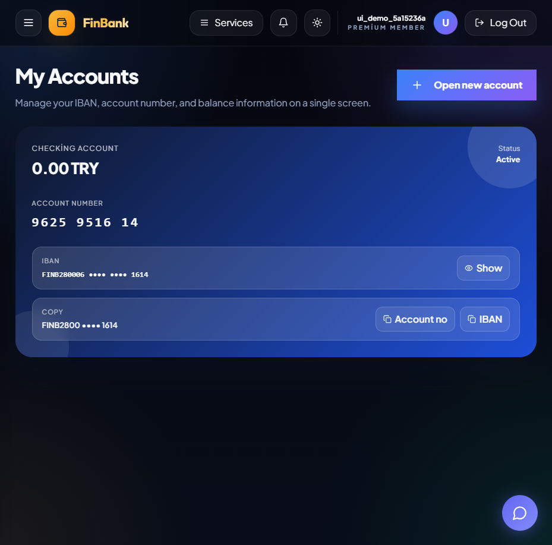
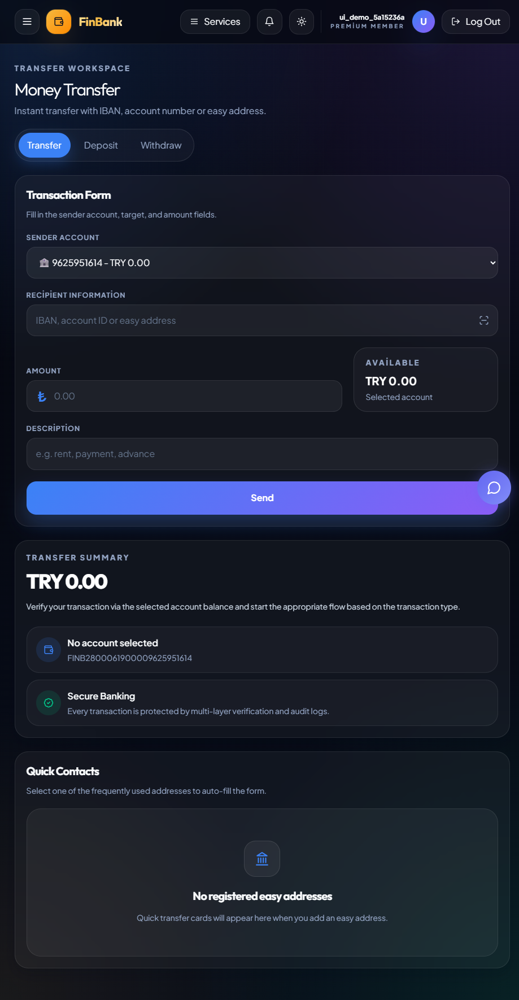
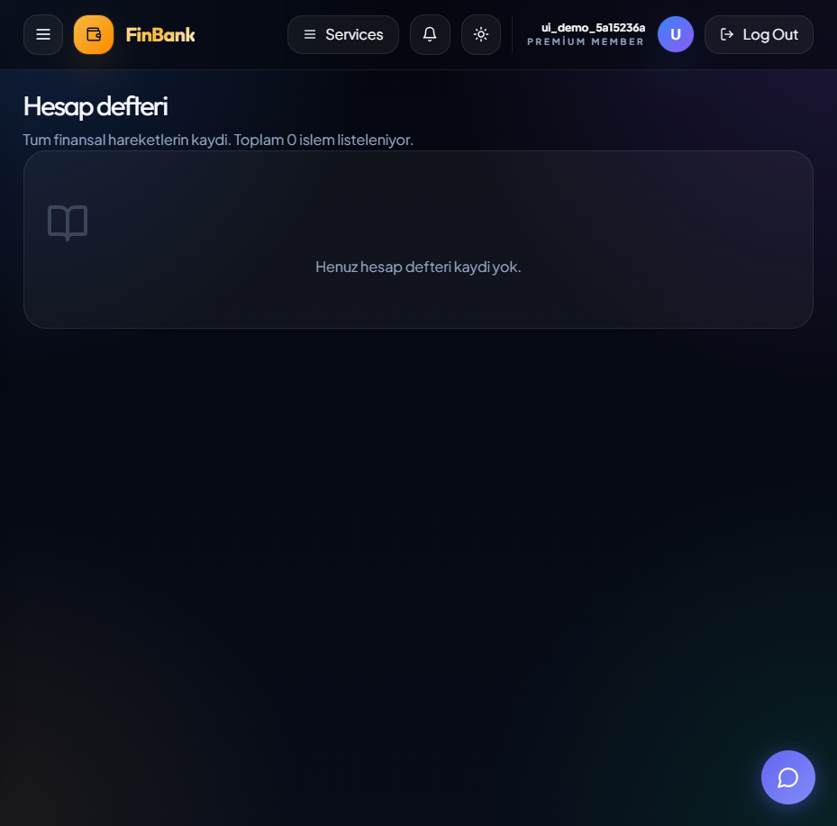
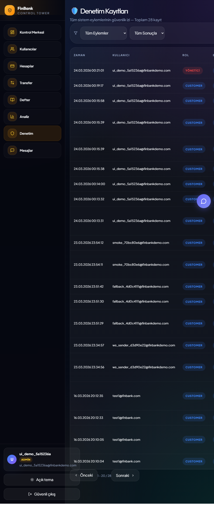

# FinBank Rubric README (Resimli ve Kanitli)

Bu klasor, hocanin verdigi **FinTech Course - Core Banking System** rubrigindeki tum maddeleri tek tek gosterir.
Her maddede su 3 sey var:
1. Durum (PASS / MANUAL / MISSING)
2. Nerede oldugu (dosya, endpoint, belge)
3. Gorsel veya calisan kanit (varsa)

- Repository: https://github.com/DommLee/finbank-core-banking
- Live Frontend: https://finbank-core-banking.pages.dev
- Backend API: https://finbank-api.onrender.com
- Bu dokumanin yolu: `docs/readme/README.md`

---

## Hemen Gorseller (UI + API)

### Login

Dosya: `docs/evidence/frontend_login.png`

### Accounts

Dosya: `docs/evidence/frontend_accounts.png`

### Transfer

Dosya: `docs/evidence/frontend_transfer.png`

### Ledger

Dosya: `docs/evidence/frontend_ledger.png`

### Admin Audit

Dosya: `docs/evidence/frontend_admin_audit.png`

### Swagger

Dosya: `docs/evidence/swagger_ui.png`

### Architecture Diagram

Dosya: `docs/architecture.png`

---

## Durum Anahtari

- `PASS`: Kod/kanit dosyasi ile dogrulandi.
- `MANUAL`: GitHub UI veya sozlu sunum tarafinda hoca kontrol etmeli.
- `MISSING`: Bu repoda yok.

---

## 1) Instructor Verification: Team Understanding

### Student 1 — System Architect / Project Lead

- [x] Student can clearly explain overall system architecture  
  Durum: `PASS`  
  Kanit: `docs/architecture.md`, `docs/architecture.png`

- [x] Student explains why chosen architecture was selected (monolith vs microservices)  
  Durum: `PASS`  
  Kanit: `docs/architecture.md`, root `README.md`

- [x] Student explains module boundaries (customer, accounts, ledger, transfers)  
  Durum: `PASS`  
  Kanit: `backend/app/api/v1/customers.py`, `accounts.py`, `transactions.py`, `ledger.py`

- [x] Student explains data flow of a transfer  
  Durum: `PASS`  
  Kanit: `docs/architecture.md`, `backend/app/services/ledger_service.py`

- [x] Student explains technology trade-offs  
  Durum: `PASS`  
  Kanit: `docs/architecture.md`, root `README.md`

- [x] Student explains how financial correctness is guaranteed  
  Durum: `PASS`  
  Kanit: append-only ledger + computed balance + transaction flow  
  Dosya: `backend/app/services/ledger_service.py`

### Student 2 — Backend & Data Engineer

- [x] Student explains ledger concept  
  Durum: `PASS`  
  Kanit: `backend/app/services/ledger_service.py`

- [x] Student explains append-only ledger logic  
  Durum: `PASS`  
  Kanit: `append_entry()` yalnizca `insert_one`

- [x] Student explains how balances are calculated  
  Durum: `PASS`  
  Kanit: `get_balance()` aggregation

- [x] Student explains transaction validation  
  Durum: `PASS`  
  Kanit: `_validate_account_ownership` + bakiye/status kontrolleri  
  Dosya: `backend/app/api/v1/transactions.py`

- [x] Student explains event flow or messaging system  
  Durum: `PASS`  
  Kanit: webhook event akisi  
  Dosya: `backend/app/events/webhook.py`

- [x] Student demonstrates API endpoints  
  Durum: `PASS`  
  Kanit: `docs/api.yaml`, `/docs`, `docs/evidence/swagger_ui.png`

### Student 3 — Frontend / DevOps Engineer

- [x] Student explains Docker architecture  
  Durum: `PASS`  
  Kanit: `docker-compose.yml`, `backend/Dockerfile`, `frontend/Dockerfile`

- [x] Student explains CI/CD pipeline  
  Durum: `PASS`  
  Kanit: `.github/workflows/ci.yml`

- [x] Student demonstrates UI interaction with backend  
  Durum: `PASS`  
  Kanit: `docs/evidence/frontend_*.png`

- [x] Student explains deployment strategy  
  Durum: `PASS`  
  Kanit: root `README.md` deployment bolumu

- [x] Student explains how logs and monitoring work  
  Durum: `PASS`  
  Kanit: request log middleware + audit log service  
  Dosya: `backend/app/main.py`, `backend/app/services/audit_service.py`

---

## 2) System Architecture Checklist

- [x] Architecture diagram included in /docs  
  Durum: `PASS`  
  Kanit: `docs/architecture.png`

- [x] System components clearly defined  
  Durum: `PASS`  
  Kanit: `docs/architecture.md`

- [x] Backend service defined  
  Durum: `PASS`  
  Kanit: `backend/app/main.py`

- [x] Database structure explained  
  Durum: `PASS`  
  Kanit: `docs/database_schema.md`

- [x] Data flow between modules documented  
  Durum: `PASS`  
  Kanit: `docs/architecture.md`

- [x] API boundaries clearly defined  
  Durum: `PASS`  
  Kanit: `docs/api.yaml`, `backend/app/api/v1/*`

- [x] Financial transaction flow explained  
  Durum: `PASS`  
  Kanit: `docs/architecture.md`, `transactions.py`, `ledger_service.py`

---

## 3) Core Banking Functional Modules (Mandatory)

### Customer & KYC

- [x] Customer creation API  
  Durum: `PASS`  
  Endpoint: `POST /api/v1/customers/`  
  Dosya: `backend/app/api/v1/customers.py`

- [x] Customer identity information stored  
  Durum: `PASS`  
  Kanit: customer alanlari (`full_name`, `national_id`, `phone`, vs.)  
  Dosya: `docs/database_schema.md`, `customers.py`

- [x] Customer status management implemented  
  Durum: `PASS`  
  Endpoint: `PATCH /api/v1/customers/{customer_id}/status`

### Account Management

- [x] Account creation endpoint  
  Durum: `PASS`  
  Endpoint: `POST /api/v1/accounts/`  
  Dosya: `backend/app/api/v1/accounts.py`

- [x] Account ownership mapping  
  Durum: `PASS`  
  Kanit: `user_id`/`customer_id` alanlari

- [x] Account balance query endpoint  
  Durum: `PASS`  
  Endpoint: `GET /api/v1/accounts/{account_id}/balance`

### Ledger (Critical Requirement)

- [x] Ledger table exists  
  Durum: `PASS`  
  Kanit: `ledger_entries` collection

- [x] Ledger entries are append-only  
  Durum: `PASS`  
  Kanit: `append_entry()` insert-only

- [x] Balance is derived from ledger entries  
  Durum: `PASS`  
  Kanit: `get_balance()` sum aggregation

- [x] No balance change without ledger entry  
  Durum: `PASS`  
  Kanit: para hareketleri `LedgerService` uzerinden

- [x] Ledger records include timestamp  
  Durum: `PASS`  
  Kanit: `created_at`

### Deposits & Withdrawals

- [x] Deposit endpoint exists  
  Durum: `PASS`  
  Endpoint: `POST /api/v1/transactions/deposit`

- [x] Withdrawal endpoint exists  
  Durum: `PASS`  
  Endpoint: `POST /api/v1/transactions/withdraw`

- [x] Both operations create ledger entries  
  Durum: `PASS`  
  Kanit: withdraw dogrudan ledger; deposit approval sonrasi ledger write

### Transfers

- [x] Internal transfer between accounts implemented  
  Durum: `PASS`  
  Endpoint: `POST /api/v1/transactions/transfer`

- [x] Transfer validation exists  
  Durum: `PASS`

- [x] Transfer authorization implemented  
  Durum: `PASS`  
  Kanit: JWT + ownership

- [x] Transfer produces two ledger entries (debit/credit)  
  Durum: `PASS`  
  Kanit: `execute_transfer()`

### Audit & Logging

- [x] Audit logs exist  
  Durum: `PASS`

- [x] Logs capture user ID  
  Durum: `PASS`

- [x] Logs capture action performed  
  Durum: `PASS`

- [x] Logs capture timestamp  
  Durum: `PASS`

- [x] Logs capture success/failure  
  Durum: `PASS`

- [x] Admin audit endpoint exists  
  Durum: `PASS`  
  Endpoint: `GET /api/v1/audit/`  
  Ekran: `docs/evidence/frontend_admin_audit.png`

---

## 4) API & Backend Quality

- [x] REST API implemented  
  Durum: `PASS`

- [x] OpenAPI / Swagger documentation exists  
  Durum: `PASS`  
  Kanit: `docs/api.yaml`, `docs/evidence/swagger_ui.png`

- [x] Input validation implemented  
  Durum: `PASS`  
  Kanit: `backend/app/models/*`

- [x] Error responses structured  
  Durum: `PASS`  
  Kanit: `backend/app/core/exceptions.py`

- [x] Logging implemented  
  Durum: `PASS`

- [x] API endpoints logically structured  
  Durum: `PASS`

---

## 5) Database Design

- [x] Database schema presented  
  Durum: `PASS`  
  Dosya: `docs/database_schema.md`

- [x] Account table implemented  
  Durum: `PASS`

- [x] Ledger table implemented  
  Durum: `PASS`

- [x] Customer table implemented  
  Durum: `PASS`

- [x] Transaction consistency explained  
  Durum: `PASS`

- [x] If NoSQL used -> ledger consistency explained  
  Durum: `PASS` (MongoDB + append-only + computed balance)

---

## 6) Event-Driven Architecture / Messaging

- [ ] Kafka implemented  
  Durum: `MISSING`

- [ ] RabbitMQ / NATS implemented  
  Durum: `MISSING`

- [ ] Redis Streams implemented  
  Durum: `MISSING`

- [ ] Outbox pattern implemented  
  Durum: `MISSING`

- [x] Webhooks implemented  
  Durum: `PASS`  
  Dosya: `backend/app/events/webhook.py`

Required events:

- [x] TransferCreated  
  Durum: `PASS`

- [x] TransferCompleted  
  Durum: `PASS`

- [x] AccountDebited  
  Durum: `PASS`

- [x] AccountCredited  
  Durum: `PASS`

---

## 7) Security Implementation

### Authentication

- [x] JWT authentication implemented  
  Durum: `PASS`  
  Dosya: `backend/app/core/security.py`

- [x] Login system exists  
  Durum: `PASS`  
  Endpoint: `POST /api/v1/auth/login`

- [x] Token validation implemented  
  Durum: `PASS`  
  Kanit: `authenticate_token`, `get_current_user`

### Authorization

- [x] Role-based access control implemented  
  Durum: `PASS`

- [x] Admin role exists  
  Durum: `PASS`

- [x] Customer role exists  
  Durum: `PASS`

### API Security

- [x] Input validation  
  Durum: `PASS`

- [x] Rate limiting  
  Durum: `PASS`

- [x] CORS configured  
  Durum: `PASS`

- [x] Secure error responses  
  Durum: `PASS`

### Secrets Management

- [x] .env.example exists  
  Durum: `PASS`

- [x] Secrets not committed to GitHub  
  Durum: `PASS` (tracked degil)

- [x] Environment variables used  
  Durum: `PASS`

---

## 8) Frontend / Mobile Interface

- [x] Login screen implemented  
  Durum: `PASS`  
  Gorsel: `docs/evidence/frontend_login.png`

- [x] Account list screen implemented  
  Durum: `PASS`  
  Gorsel: `docs/evidence/frontend_accounts.png`

- [x] Transfer form implemented  
  Durum: `PASS`  
  Gorsel: `docs/evidence/frontend_transfer.png`

- [x] Ledger view implemented  
  Durum: `PASS`  
  Gorsel: `docs/evidence/frontend_ledger.png`

- [x] Admin audit view implemented  
  Durum: `PASS`  
  Gorsel: `docs/evidence/frontend_admin_audit.png`

---

## 9) Docker & Infrastructure

- [x] Dockerfile exists  
  Durum: `PASS`

- [x] Docker Compose configuration exists  
  Durum: `PASS`

- [x] System runs using docker compose up --build  
  Durum: `PASS`  
  Kanit: `docs/evidence/docker_ps.txt`, `docs/evidence/health.json`

- [x] Backend container runs  
  Durum: `PASS`

- [x] Database container runs  
  Durum: `PASS`

- [x] Optional services run (Kafka/Redis)  
  Durum: `PASS` (webhook optional service var)

---

## 10) GitHub Workflow

- [x] GitHub repository exists  
  Durum: `PASS`

- [x] README documentation present  
  Durum: `PASS`

- [x] Branch strategy implemented (main/dev/feature)  
  Durum: `PASS`

- [ ] Pull requests used  
  Durum: `MANUAL` (GitHub UI kontrol)

- [ ] Minimum 3 PRs per team  
  Durum: `MANUAL` (GitHub UI kontrol)

- [ ] Issue board used  
  Durum: `MANUAL` (GitHub UI kontrol)

---

## 11) CI/CD Pipeline

- [x] GitHub Actions pipeline exists  
  Durum: `PASS`  
  Dosya: `.github/workflows/ci.yml`

- [x] Build step implemented  
  Durum: `PASS`

- [x] Lint step implemented  
  Durum: `PASS`

- [x] Tests executed  
  Durum: `PASS`  
  Kanit: `docs/evidence/backend_pytest.txt`

- [ ] Pipeline status visible in repository  
  Durum: `MANUAL` (GitHub Actions UI)

---

## 12) Documentation Quality

- [x] Architecture diagram  
  Durum: `PASS`

- [x] API specification (OpenAPI)  
  Durum: `PASS`

- [x] Security notes  
  Durum: `PASS`

- [x] Technology decision explanation  
  Durum: `PASS`

- [x] Financial system explanation  
  Durum: `PASS`

---

## 13) Financial System Awareness

- [x] ISO 20022  
  Durum: `PASS`  
  Dosya: `backend/app/utils/iso20022.py`

- [x] SWIFT messaging  
  Durum: `PASS`  
  Dosya: `docs/financial_standards.md`

- [x] EMV payment infrastructure  
  Durum: `PASS`  
  Dosya: `docs/financial_standards.md`

- [x] Open Banking APIs  
  Durum: `PASS`  
  Dosya: `docs/financial_standards.md`

- [x] REST API conceptual mapping  
  Durum: `PASS`

---

## 14) End-to-End Banking Demo

- [x] User registration  
  Durum: `PASS`  
  Kanit: `docs/evidence/ws_smoke.txt`

- [x] Login  
  Durum: `PASS`  
  Kanit: `docs/evidence/ws_smoke.txt`

- [x] Customer creation  
  Durum: `PASS`  
  Kanit: register akisinda otomatik customer profile

- [x] Account opening  
  Durum: `PASS`  
  Kanit: endpoint + `frontend_accounts.png`

- [x] Deposit  
  Durum: `PASS`

- [x] Transfer  
  Durum: `PASS`  
  Kanit: `frontend_transfer.png`

- [x] Ledger verification  
  Durum: `PASS`  
  Kanit: `frontend_ledger.png`

- [x] Audit log review  
  Durum: `PASS`  
  Kanit: `frontend_admin_audit.png`

---

## 15) Bonus Features (Extra Work)

- [~] Microservices architecture  
  Durum: `MANUAL/PARTIAL`  
  Kanit: `services/` ve `infra/docker-compose.yml` scaffold

- [ ] Mobile application  
  Durum: `MISSING`

- [x] Advanced event streaming  
  Durum: `PASS` (WebSocket + webhook)

- [x] Performance optimizations  
  Durum: `PASS` (indexler + async)

- [ ] Monitoring dashboards  
  Durum: `MISSING` (bu repoda yok)

- [x] Security hardening  
  Durum: `PASS`

- [ ] Load testing  
  Durum: `MISSING`

- [x] Fraud detection logic  
  Durum: `PASS` (risk score + approval flow)

---

## Calisan Kanit Dosyalari (Hoca icin hizli liste)

- `docs/evidence/health.json`
- `docs/evidence/docker_ps.txt`
- `docs/evidence/swagger_status.txt`
- `docs/evidence/swagger_ui.png`
- `docs/evidence/ws_smoke.txt`
- `docs/evidence/backend_pytest.txt`
- `docs/evidence/backend_ruff.txt`
- `docs/evidence/frontend_eslint.txt`
- `docs/evidence/frontend_build.txt`
- `docs/evidence/frontend_login.png`
- `docs/evidence/frontend_accounts.png`
- `docs/evidence/frontend_transfer.png`
- `docs/evidence/frontend_ledger.png`
- `docs/evidence/frontend_admin_audit.png`

---

## Not

Bu dosya, rubrikteki tum maddeleri tek yerde toplar. GitHub UI tarafindan dogrulanacak maddeler `MANUAL` olarak isaretlenmistir.
